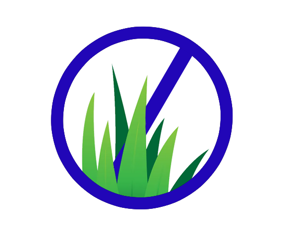

# Roundup: Robot Control App


https://user-images.githubusercontent.com/95944392/224509408-8cf81484-2df1-4522-b72b-3398e59669f4.mp4

https://user-images.githubusercontent.com/95944392/230803867-7e4617c9-662d-4df7-9e29-15715888454c.mp4

---

## Course: COSC 426
## Client: Dr. Giulia Franchi

## Team: Kids Against Weed



---
### Teammates:
* Zach Moore
* Emily Hitchcock
* Garrett Jolly
* Nick Krisulevicz
* Dane Akers
---
## Installation Instructions

```
Currently installed by running command in Flutter: will be updated with final release of product
```
---
## Contents of Repository

### Control

```
Contains Arduino code to control the robot, which includes: Laser Activation/Deactivation, and navigation
control. Both manual control and autonomous control source code resides within this directory
```

### Camera

```
Contains Arduino source code for the ESP32 camera. The ESP32 can broadcast an IP address that can be accessed
remotely from a web browser, i.e: Google Chrome, Firefox, etc. The broadcast streams video with
adjustable resolution and filters.
```

### Images

```
Contains various assets used during development of the app. App logos, splashscreens, and possibly other assets for 
styling are included.
```

### Bluetooth Controller

```
Contains the flutter app created for the project. 
```

### Object Recognition

```
Contains a python script which uses OpenCV and Numpy to detect colors. OpenCV allows for use of a filter that only 
displays certain color hues.
```
---
## Client Updates

```
Meeting 1:
-Team was instructed to finish robot design using existing hardware.
  -Suggested chassis redesign was tabled for later focus by client
  -The team is to continue with acrylic robot chassis currently in use
-Team was given the milestone of having functional autonomous program before 03/17/2023
  -The milestone requirements are as follows:
    -Have a basic autonomous driving algorithm in place
    -Have object recognition algorithm in place
    -

Meeting 2:
-Team demonstrated object recognition to client
-Team demonstrated currently functioning app to the client
-Client laid out expectations between then and the end of the first milestone. 

Meeting 3:
-Details to follow - meeting scheduled for 03/14/2023
```
