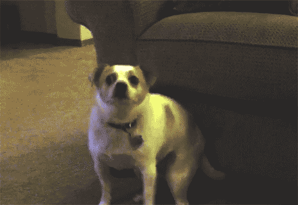

# Roundup: Robot Control App




### Course: COSC 426
### Client: Dr. Giulia Franchi

#### Team: Kids Against Weed


---
### Teammates:
* Zach Moore
* Emily Hitchcock
* Garrett Jolly
* Nick Krisulevicz
* Dane Akers

## Installation Instructions

```
Currently installed by running command in Flutter: will be updated with final release of product
```

## Contents of Repository

### Control

```
Contains Arduino code to control the robot, which includes: Laser Activation/Deactivation, and navigation control.
```

### Camera

```
Contains Arduino source code for the ESP32 camera. The ESP32 can broadcast an IP address that can be accessed remotely 
from a web browser, i.e: Google Chrome, Firefox, etc. The broadcast streams video with adjustable resolution and 
filters.
```

### Images

```
Contains various assets used during development of the app. App logos, splashscreens, and possibly other assets for 
styling are included.
```

### Bluetooth Controller

```
Contains the flutter app created for the project. 
```

### Object Recognition

```
Contains a python script which uses OpenCV and Numpy to detect colors. OpenCV allows for use of a filter that only 
displays certain color hues.
```
